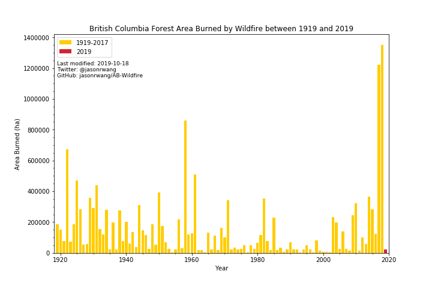

# Alberta and British Columbia Wildfire Area Statistics Compilation

A quick peek into Alberta and British Columbia's wildfire histories (we started with just Alberta).

Last modified: 2019-06-01 (or the latest date shown on my GitHub repo)

## Preamble

Wildfire season has hit Alberta once again, and my friends and family back home are posting feverously on social media about the orange haze that has hit Alberta. Of course, there's similarly bickering about how much of this is 'normal'. We know that wildfires are intensified by the climate emergency, but there are undoubtedly many more causes.

The purpose of this little notebook is just to answer a question that's been on my mind: _how does this wildfire season actually compare to previous years?_ Surprisingly, this wasn't very easy to find online, so I decided to do some work mmyself.

Of course this analysis is limited by the quality of data available. I've done my best to double check and, where I could, validate these numbers by cross-referencing them across multiple government-published data sources.

Lastly, I want to thank all the brave lookout staff, firefighters, civil servants, and countless more people on the frontlines fighting the fires. It's a dangerous and incredibly tiring job to deal with such crises. Similarly, my heart goes out to all those displaced by the fires.

### To Do:

- Alberta's Historical Wildfire Database has data from 1931 to 1968 recorded on microfilm. Since I wanted to do this today, and also since I'm not in Edmonton, I had to leave this time period out.
- Look at other factors for fires, like aridity and duration of actual fire season
- Add in other provinces
- Make scripts a bit more robust for next year... how?

### For more reading:

#### Explained

- [Carman, Tara (2017, July 29). Area of B.C. burned by wildfires at a 56-year high. CBC News.](https://www.cbc.ca/news/canada/british-columbia/area-of-b-c-burned-by-wildfires-at-a-56-year-high-1.4226227)
- Tara Carman's [GitHub Repo](https://github.com/taracarman/BC_Wildfires/blob/master/BC%20Wildfires.ipynb) for the above story; this project also partly inspired by Tara's work!
- [Nadkarni, Kabir (2018, September 01). Opinion: UCP's climate denial unacceptable in face of worsening wildfire trends. The Gateway.](https://www.thegatewayonline.ca/2018/09/ucp-climate-denial-unacceptable-wildfire-trends/)
- [McGillivray, Glenn (2019, May 29). Opinion: Climate change is a big factor in Alberta’s wildfires – but not in the way you might think. The Globe and Mail.](https://www.theglobeandmail.com/opinion/article-climate-change-is-a-big-factor-in-albertas-wildfires-but-not-in-the/)
- [Pierre-Louis, Kendra & Popovich, Nadja (2018, November 27). Climate Change Is Fueling Wildfires Nationwide, New Report Warns. The New York Times.](https://www.nytimes.com/interactive/2018/11/27/climate/wildfire-global-warming.html)
- [Thomson, Graham (2019, May 29). Opinion: Kenney not a climate change denier but a climate change dodger. iPolitics](https://ipolitics.ca/2019/05/29/kenney-not-a-climate-change-denier-but-a-climate-change-dodger/)

#### Academic

- [Flannigan, Mike (n.d.). Fire and Climate Change. University of Alberta.](https://sites.ualberta.ca/~flanniga/climatechange.html)
- [cffdrs: an R package for the Canadian Forest Fire Danger Rating System. Canada Wildfire.](https://www.canadawildfire.org/cffdrs-r-package)
- (Paywalled) [Robinne, F.-N., Parisien, M.-A., & Flannigan, M. (2016). Anthropogenic influence on wildfire activity in Alberta, Canada. International Journal of Wildland Fire, 25(11), 1131.](https://doi.org/10.1071/WF16058)